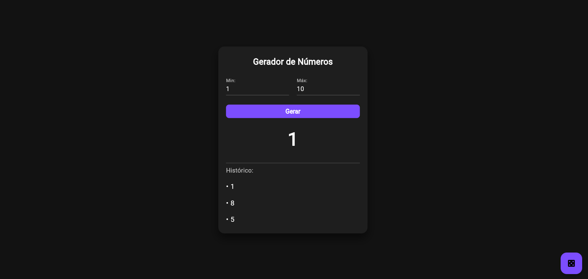

# 🎲 Gerador de Números - Flutter

<div align="center">
  
  
  
  
  
</div>

<div align="center">
  <h3>🚀 Gerador avançado de números aleatórios com tema escuro</h3>
  <p>Projeto desenvolvido para a disciplina de Sistemas de Computação Móvel</p>
</div>

---

## 📱 Sobre o Projeto

O **Gerador de Números** é uma aplicação mobile multiplataforma desenvolvida em Flutter que permite aos usuários gerar números aleatórios dentro de intervalos completamente personalizáveis. Com uma interface moderna em tema escuro, validação robusta e histórico de números, o app demonstra conceitos avançados do desenvolvimento Flutter.

### ✨ Características Principais

- 🎯 **Intervalos Personalizáveis**: Defina valores mínimo e máximo customizados
- � **Tema Escuro Moderno**: Interface elegante com Material Design 3
- ✅ **Validação Robusta**: Controle rigoroso de entrada com feedback visual
- 📊 **Histórico Inteligente**: Lista dos últimos números gerados
- ⚡ **Animações Suaves**: Transições elegantes com AnimatedSwitcher
- 📱 **Design Responsivo**: Layout adaptável a diferentes tamanhos de tela
- 🔄 **Dupla Interação**: Botão principal e FloatingActionButton
- 🎨 **Interface Premium**: Cards com sombras e bordas arredondadas

## 📸 Screenshots

<div align="center">
  
  <br>
  <em>Interface principal do aplicativo em tema escuro</em>
</div>

## �🛠️ Tecnologias Utilizadas

- **Framework**: Flutter 3.19.2
- **Linguagem**: Dart 3.9.2
- **Gerenciamento de Estado**: StatefulWidget com FormKey
- **UI Kit**: Material Design 3 (Tema Escuro)
- **Geração Aleatória**: dart:math Random()
- **Validação**: Flutter Form Validation + TextInputFormatters
- **Animações**: AnimatedSwitcher para transições suaves
- **Controle de Entrada**: flutter/services FilteringTextInputFormatter
- **Testes**: Flutter Test Framework

## 📂 Estrutura do Projeto

```
flutter_application_1/
├── 📁 lib/
│   └── 📄 main.dart                 # Código principal da aplicação
├── 📁 images/
│   └── 📁 screenshots/              # Screenshots do aplicativo
│       └── 📄 App.png               # Interface principal
├── 📁 test/
│   └── 📄 widget_test.dart          # Testes automatizados
├── 📁 android/                      # Configurações Android
├── 📁 ios/                          # Configurações iOS
├── 📁 web/                          # Configurações Web
├── 📁 windows/                      # Configurações Windows
├── 📁 macos/                        # Configurações macOS
├── 📁 linux/                        # Configurações Linux
├── 📄 pubspec.yaml                  # Dependências e configurações
├── 📄 README.md                     # Este arquivo
└── 📄 DOCUMENTATION.md              # Documentação técnica detalhada
```

## 🚀 Como Executar o Projeto

### Pré-requisitos

- [Flutter SDK](https://flutter.dev/docs/get-started/install) (≥ 3.19.2)
- [Dart SDK](https://dart.dev/get-dart) (≥ 3.9.2)
- Editor de código (VS Code, Android Studio ou IntelliJ)

### Instalação e Execução

1. **Clone o repositório**
   ```bash
   git clone https://github.com/seu-usuario/sorteador-numeros-flutter.git
   cd sorteador-numeros-flutter
   ```

2. **Instale as dependências**
   ```bash
   flutter pub get
   ```

3. **Verifique os dispositivos disponíveis**
   ```bash
   flutter devices
   ```

4. **Execute o aplicativo**
   ```bash
   # Web (Chrome)
   flutter run -d chrome
   
   # Windows Desktop
   flutter run -d windows
   
   # Android (com emulador/dispositivo conectado)
   flutter run -d android
   
   # iOS (apenas no macOS)
   flutter run -d ios
   ```

## 🎮 Como Usar

1. **Definir Intervalo**: Insira os valores mínimo e máximo nos campos
2. **Validação Automática**: O app verifica automaticamente se os valores são válidos
3. **Gerar Número**: Clique no botão "Gerar" ou no ícone flutuante
4. **Ver Resultado**: O número aparece com animação suave na tela
5. **Histórico**: Acompanhe os últimos números gerados na lista abaixo
6. **Repetir**: Gere quantos números quiser dentro do mesmo intervalo

## 🧪 Executar Testes

```bash
# Executar todos os testes
flutter test

# Executar testes com cobertura
flutter test --coverage

# Executar testes específicos
flutter test test/widget_test.dart
```

## 📦 Build para Produção

### Android
```bash
flutter build apk --release          # APK para distribuição
flutter build appbundle --release    # App Bundle para Play Store
```

### iOS
```bash
flutter build ios --release          # Build para App Store
```

### Web
```bash
flutter build web --release          # Build para hospedagem web
```

### Desktop
```bash
flutter build windows --release      # Windows
flutter build macos --release        # macOS
flutter build linux --release        # Linux
```

## 🎨 Screenshots

<div align="center">
  
</div>

## 🏗️ Arquitetura

O projeto segue os padrões recomendados do Flutter:

- **Widget Tree**: Hierarquia clara e organizada de widgets
- **State Management**: Uso do StatefulWidget para gerenciar estado local
- **Separation of Concerns**: Lógica de negócio separada da apresentação
- **Material Design**: Seguindo as diretrizes do Google Material Design

## 📋 Recursos Implementados

- ✅ **Intervalos Personalizáveis**: Definição livre de min/max
- ✅ **Tema Escuro Premium**: Interface moderna com Material Design 3
- ✅ **Validação Completa**: Campos obrigatórios e verificação de tipos
- ✅ **Histórico Inteligente**: Lista dos números gerados
- ✅ **Animações Suaves**: Transições elegantes com AnimatedSwitcher
- ✅ **Design Responsivo**: Layout adaptável com ConstrainedBox
- ✅ **Controle de Entrada**: Apenas números permitidos
- ✅ **Feedback Visual**: SnackBars e validação em tempo real
- ✅ **Gerenciamento de Estado**: StatefulWidget otimizado
- ✅ **Suporte Multiplataforma**: Todas as plataformas Flutter
- ✅ **Testes Atualizados**: Cobertura das novas funcionalidades

## 🔮 Próximas Funcionalidades

- [ ] **Estatísticas Avançadas**: Média, moda, frequência dos números
- [ ] **Exportar Histórico**: Salvar lista em arquivo
- [ ] **Temas Múltiplos**: Modo claro + temas personalizados
- [ ] **Configurações Avançadas**: Distribuições não-uniformes
- [ ] **Animações Premium**: Efeitos visuais mais elaborados
- [ ] **Internacionalização**: Suporte a múltiplos idiomas
- [ ] **Acessibilidade**: Melhor suporte para leitores de tela
- [ ] **Backup na Nuvem**: Sincronização do histórico

## 🤝 Contribuindo

Contribuições são bem-vindas! Para contribuir:

1. Fork o projeto
2. Crie uma branch para sua feature (`git checkout -b feature/AmazingFeature`)
3. Commit suas mudanças (`git commit -m 'Add some AmazingFeature'`)
4. Push para a branch (`git push origin feature/AmazingFeature`)
5. Abra um Pull Request

### Guidelines para Contribuição

- Siga o [Dart Style Guide](https://dart.dev/guides/language/effective-dart/style)
- Mantenha o código bem documentado
- Adicione testes para novas funcionalidades
- Atualize a documentação quando necessário

## 🐛 Reportar Bugs

Encontrou um bug? [Abra uma issue](https://github.com/seu-usuario/sorteador-numeros-flutter/issues) com:

- Descrição clara do problema
- Passos para reproduzir
- Screenshots (se aplicável)
- Informações do ambiente (OS, versão Flutter, etc.)

## 📄 Licença

Este projeto está sob a licença MIT. Veja o arquivo [LICENSE](LICENSE) para mais detalhes.

## 👨‍💻 Autor

**Wenderson**
- 🎓 Análise e Desenvolvimento de Sistemas - 4º Período
- 📚 Disciplina: Sistemas de Computação Móvel
- 📧 Email: wenderson.teles@icloud.com
- 💼 LinkedIn: www.linkedin.com/in/wenderson-jose
- 🐙 GitHub: https://github.com/Wendersonjose

## 🙏 Agradecimentos

- **Professor(a)**: Amanda Rosa Ferreira Pela orientação na disciplina de Sistemas de Computação Móvel
- **Faculdade**: Pelo ambiente de aprendizado proporcionado
- **Comunidade Flutter**: Pela documentação e recursos disponíveis

---

<div align="center">
  <p>⭐ Se este projeto foi útil para você, considere dar uma estrela!</p>
  <p>Desenvolvido com ❤️ usando Flutter</p>
</div>

## 📊 Status do Projeto

<div align="center">
  
  
  
</div>

---

**Última atualização**: Outubro 2025
